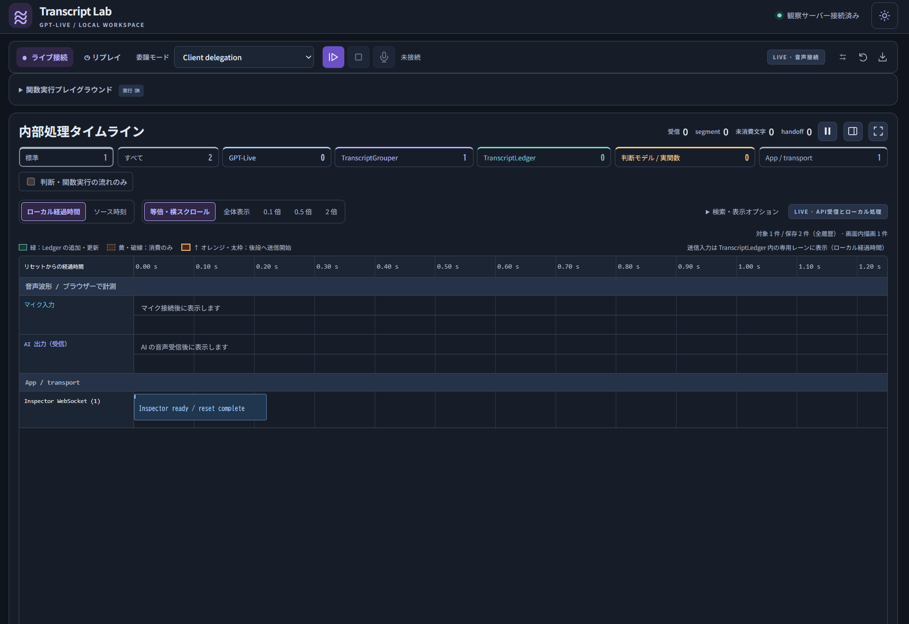

# GPT-Live Transcript Lab

[English](README.md) | **日本語**

`gpt-live-1` の会話処理と天気検索の実行経路を可視化する、ローカル専用の Python Web UI です。
画面と扱う会話は、日本語と英語を切り替えられます。



## 機能概要

- 合成イベントのリプレイと、Azure OpenAI / OpenAI へのマイク接続。
- Client delegation / Responses delegation の切替と、方式ごとの処理タイムライン。
- TranscriptGrouper、Client モードの TranscriptLedger、音声波形の表示。
- Function Calling / Jev 判断による天気検索と、記録の JSON 保存。Jev は Client モード専用です。
- 日本語 / 英語の表示切り替え。音声指示・判断モデルへの指示・リプレイの会話・天気の要約も切り替わります。

## 起動

Python 3.11 以上が必要です。ブラウザー用バンドルを同梱しているため、通常の起動に Node.js は不要です。
このリポジトリのルートで実行してください。

### Windows（PowerShell）

```powershell
py -3 -m venv .venv
.\.venv\Scripts\python.exe -m pip install -r requirements.txt
.\.venv\Scripts\python.exe app.py
```

### macOS / Linux

```sh
python3 -m venv .venv
.venv/bin/python -m pip install -r requirements.txt
.venv/bin/python app.py
```

ブラウザーで **http://localhost:8765** を開きます。ポートを変更する場合は起動コマンドに `--port 8875` を追加します。

**API なしで試す場合**：Client delegation を選び、「関数実行プレイグラウンド」の「天気検索を実行する」を OFF にしてから「リプレイ」を選びます。
ON のままでは、リプレイでも判断 API の料金が発生し得ます。

## 表示言語

右上の **English** / **日本語** ボタン、または **http://localhost:8765/?lang=en** で切り替えます。
選択はブラウザーに保存し、未選択の場合はブラウザーの言語設定（`ja` なら日本語、それ以外は英語）に従います。
切り替えるとページを再読み込みし、保存していない記録は失われます。ライブ接続中は切り替えられません。
英語モードでは AI が英語で話し、"What's the weather in Tokyo right now?" のような英語の依頼を受け付けます。
詳しくは [表示言語](docs/usage.ja.md#表示言語)を参照してください。

## 委譲モード

接続前に、画面上部の「委譲モード」で選択します。接続中は変更できません。
**モードを変更すると記録がリセットされます。必要な記録は先に JSON 保存してください。**

| モード | 文脈・判断 | 表示・制約 |
| --- | --- | --- |
| Client delegation | Ledger の会話をアプリが Function Calling または Jev へ送信 | Ledger、モデル判断、関数実行、commentary 送信・ACK。リプレイと音声なし実行も利用可能 |
| Responses + Function Calling | GPT-Live が Responses モデルへ会話文脈を供給 | Ledger は生成・使用しない。Responses イベント、関数実行、結果送信、明示的続行、完了・失敗。ライブ専用 |

Responses モードでも関数の検証・実行はアプリが担当します。結果を `response.item.create` で返し、`response.create` で続行します。
検索 OFF は天気関数の実行を止める設定です。音声セッションと Responses モデルの料金は OFF でも発生し得ます。
詳しくは [委譲モードの操作ガイド](docs/usage.ja.md#委譲モード)と [公式仕様](https://learn.microsoft.com/azure/foundry/openai/how-to/gpt-live-delegation)を参照してください。

## API 接続設定

実 API を使う場合のみ、[.env.example](.env.example) を参考にルートへ `.env` を作成します。
既存の環境変数が優先されます。設定変更後はサーバーを再起動してください。

| 用途 | 設定 |
| --- | --- |
| Azure のライブ音声 | `LIVE_PROVIDER=azure`、`AZURE_OPENAI_ENDPOINT`、`AZURE_OPENAI_DEPLOYMENT` |
| OpenAI のライブ音声 | `LIVE_PROVIDER=openai`、`OPENAI_API_KEY` |
| Client + Function Calling | Azure の接続設定と `AZURE_OPENAI_BACKEND_DEPLOYMENT`（既定 `gpt-6-luna`） |
| Client + Jev 判断 | `TYPESAFE_API_KEY`。任意で `TYPESAFE_MODEL`（既定 `jev-latest`）、`JEV_CONFIDENCE_THRESHOLD`（既定 `0.75`） |
| Responses + Function Calling | ライブ接続設定と、任意の `LIVE_RESPONSES_MODEL`。Azure は同じリソース内のデプロイ名、OpenAI はモデル ID |

Azure は `AZURE_OPENAI_API_KEY`、または `az login` 済みの Azure CLI アカウントを使います。
後者には対象リソースの `Cognitive Services OpenAI User` 権限が必要です。
Client モードの Function Calling は音声の接続先にかかわらず Azure の `gpt-6-luna` 系デプロイを使用します。
Responses モードのモデルを省略した場合、Azure では `AZURE_OPENAI_BACKEND_DEPLOYMENT`（既定 `gpt-6-luna`）、OpenAI では `gpt-5.5` を使います。接続先でのモデルの提供状況・利用権限は別途確認してください。
ライブ音声にはモデルの利用権限とブラウザーのマイク許可が必要です。
詳細は [接続設定](docs/usage.ja.md#接続設定)と [Azure の公式手順](https://learn.microsoft.com/azure/foundry/openai/how-to/gpt-live-webrtc)を参照してください。

## 構成

| パス | 役割 |
| --- | --- |
| [app.py](app.py) | HTTP / WebSocket サーバー、音声セッションの作成 |
| [lab/](lab/) | 会話状態、認証、判断モデル、天気検索、表示言語 |
| [static/](static/) | ブラウザー UI、英訳辞書、ビルド済みバンドル |
| [frontend/](frontend/)・[scripts/](scripts/) | バンドルの入口、ビルド・配布処理 |
| [vendor/](vendor/) | 公式ヘルパーの固定版とライセンス |
| [tests/](tests/) | Python / Node.js のテスト |
| [docs/](docs/) | 操作ガイド・詳細仕様 |

## ドキュメント

- [操作ガイド・詳細仕様・開発手順](docs/usage.ja.md)
- [セキュリティ・データの取り扱い](SECURITY.ja.md)

**インターネットや LAN にサーバーを公開しないでください。** 実 API は有料です。
自作部分のライセンスは未指定です。同梱コードの条件は [THIRD_PARTY_NOTICES.md](THIRD_PARTY_NOTICES.md)を参照してください。
