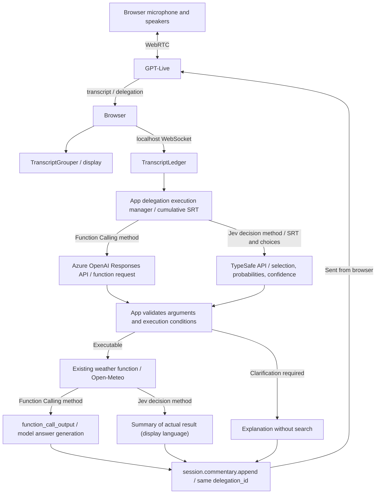

# Usage Guide and Detailed Specification

[日本語](usage.md) | **English**

For build and startup instructions and the file layout, see the [README](../README.en.md).

This is a local-only Python Web UI for observing `gpt-live-1` transcript processing.
**Switch between Client delegation and Responses delegation to observe the execution path for weather search.**
The Ledger and Function Calling / Jev comparison below describes Client mode.
The Function Calling method uses the Azure OpenAI Responses API. The model generates function-call arguments from the function JSON Schema and SRT, and the app executes the function. The actual result is returned to the model to generate the answer.
Jev selects an operation from the SRT and predefined choices. If the execution conditions are met, the app calls the existing weather function.
The Jev method formats its answer in code from the actual result and does not call an additional answer-generation model.
The timeline shows the input, decision, execution, and return path for both methods. There is no general web search or arbitrary code execution.

**Grouper and Ledger process the same events in parallel. For Function Calling and Jev, one method is selected for each delegation.**
Responses mode uses only Grouper. It does not generate, record, or consume Ledger data.

## Display language

The app runs in Japanese (the original) or English. Use the **English** / **日本語** button in the upper right,
next to the theme button, to switch. The button always names the other language in that language.

- The choice is saved in the browser (`localStorage`). You can also open `http://localhost:8765/?lang=en` or `?lang=ja`.
  Without a saved choice, the browser language decides: Japanese for `ja`, otherwise English.
- Switching reloads the page, because the server-side processing of the page also follows the language.
  **Unsaved recordings are lost**, so the app asks for confirmation when events have been recorded. Save JSON first if needed.
  The button is disabled while a live connection is active.
- What follows the language: screen text, replay scenarios, the default Live voice instructions, backend and Jev prompts,
  clarifications and error messages returned to Live, weather summaries, the city names used as function arguments
  (`東京` / `Tokyo`), Jev choice IDs (`weather_東京_current` / `weather_Tokyo_current`), and the phrasing understood by the
  SRT helper `search_weather()`.
- What does not: raw API events, IDs, server logs, and some upstream error messages stay as they are. A saved JSON file
  contains text in the language that was active when it was recorded.
- The browser sends the language as `lang` on `GET /api/config` and the `/ws` observation WebSocket, and as `language`
  in the `POST /api/session` body. The server keeps it per request / WebSocket connection (`lab/i18n.py`).

## Delegation mode

Before connecting, select Client delegation or Responses + Function Calling in **Delegation mode** at the top of the screen.
You cannot change this while connected. Disconnect, switch modes, and start a new session.
**Changing Delegation mode resets the recording, so save any required recording as JSON first.**

| Configuration | Context sent to the backend | Ledger | Available inputs |
| --- | --- | --- | --- |
| Client + Function Calling | Prepared by the app | Used | Live, replay, no-audio run |
| Client + Jev | Prepared by the app | Used | Live, replay, no-audio run |
| Responses + Function Calling | Supplied by GPT-Live | Not used | Live only |

### Responses mode operation and timeline

1. Select **Responses + Function Calling** and confirm the configured delegation target model.
2. Turn **Run weather search** ON, connect, and ask for the current weather in a supported city.
3. Check `target: responses` and `response_id` on `session.delegation.created`, followed by the function request inside `response.event`.
4. The app validates the function name and arguments, then executes the allowed weather function. It returns the result with `response.item.create` and then sends `response.create`.
5. Check whether Responses continues, completes, or fails. The answer is automatically injected into Live; the app does not send an additional `session.commentary.append` on top of it.

The timeline switches between **Voice conversation / RAW transcript**, **Responses delegation**, **Responses events / function request**, **App function execution / result**, **Function result send / resume processing**, and **Responses complete / automatic Live injection**.
You can filter by delegation ID, but audio or transcript items that cannot be associated by ID are not guessed to belong to a specific delegation.
Ledger panels, lanes, and summaries are hidden, and Jev, replay, manual consume, and no-audio runs are unavailable.
Returning to Client mode restores the previous display and operations.

When search is OFF or the function request is invalid, the app does not retrieve weather data and returns an error function result to the model.
Even with search OFF, charges may still apply for the voice session and the Responses model.
This lab limits successful weather searches to at most one per delegation and function requests to at most four per delegation.
If result submission fails, the app does not send a continuation request. Duplicate completion events do not re-execute the same function request.
The app waits up to 10 seconds for sending, up to 30 seconds for weather retrieval, and up to 90 seconds for delegation completion.
These are limits in [execution control](../lab/execution.py), not service limits.

Adding a function result does not have its own success ACK. **Sent** means the browser confirmed sending; it does not guarantee API acceptance.
Responses completion also does not mean Live has finished speaking or that the user has finished hearing the audio.
Specification: [Azure OpenAI GPT-Live delegation](https://learn.microsoft.com/azure/foundry/openai/how-to/gpt-live-delegation).

## Connection settings

The initial view is the first **Live connection** tab. Connection and microphone acquisition start only when you press **Allow microphone and connect**; the app does not auto-connect.
To try the app without using APIs, open **Function execution playground**, turn **Run weather search** OFF in Client mode, and then switch to the second **Replay** tab.
If you play a replay without turning search OFF, even synthetic delegation events may issue requests to the selected decision API.
In English mode, the default Live voice instructions start with "Speak English, naturally and briefly." and do not include the Japanese pronunciation guide used in Japanese mode.

- **Playback demo (execution OFF)**: No API key is required. Synthetic events are passed through the actual processing classes. This is not playback of an API recording.
- **Real microphone connection**: Set `AZURE_OPENAI_ENDPOINT` / `AZURE_OPENAI_DEPLOYMENT` in `.env` and connect to Azure OpenAI. If there is no API key, the app uses the **signed-in Azure CLI account**. Run `az login` in advance and grant the target resource the `Cognitive Services OpenAI User` role. You can also use API-key authentication by setting `AZURE_OPENAI_API_KEY`. These two environment variable names are used for the voice connection endpoint and deployment name.
- **Client mode Function Calling decision model**: Uses the `gpt-6-luna` deployment in the same `AZURE_OPENAI_ENDPOINT`. If your deployment name differs, set `AZURE_OPENAI_BACKEND_DEPLOYMENT` (default: `gpt-6-luna`). This is independent of the voice `AZURE_OPENAI_DEPLOYMENT`. Authentication uses the same API key or Azure CLI, and credentials are not returned to the browser. This method uses the Azure OpenAI Responses API even when the voice connection goes directly to OpenAI. The Jev decision method uses the TypeSafe API instead of this decision model. Changing the deployment name is not changing the model type. The implementation verifies that the response `model` is `gpt-6-luna` or starts with `gpt-6-luna-`, and rejects other values.
- **Responses mode decision model**: Specify it with `LIVE_RESPONSES_MODEL`. On Azure, use a deployment name in the same resource as Live; when omitted, `AZURE_OPENAI_BACKEND_DEPLOYMENT` is used (default: `gpt-6-luna`). On OpenAI, use a model ID; when omitted, the default is `gpt-5.5`. Client mode model-name validation does not apply to this path. The configuration uses `tool_choice: auto` and `parallel_tool_calls: false`. The presence of a setting does not guarantee that the model is available.
- **Direct connection to OpenAI**: Set `LIVE_PROVIDER=openai` and `OPENAI_API_KEY`. If Azure settings remain, `LIVE_PROVIDER` still takes precedence. [.env.example](../.env.example) is a configuration example. Create `.env` at the root only when needed, and do not overwrite existing settings. Environment variables take precedence when present. Restart the server after changes.
- GPT-Live access, microphone permission, and HTTPS or localhost are required. The audio is AI-generated. Real connections are paid, and WebRTC initialization can also meet billing conditions. Check the [official pricing and initialization billing notes](https://developers.openai.com/api/docs/guides/voice-latency-cost?api=live).
- Connections to localhost require no login. **Do not expose this app to the internet or a LAN.**

### Checking connection errors

- If session creation fails, the screen shows the HTTP status plus Azure / OpenAI `code`, `type`, `param`, `message`, and request ID to the extent returned by the service. Credentials, sent instructions, and SDP / ICE credentials are masked, and the raw response body is not displayed. Server logs keep only the status; check details on the screen. The app does not retry automatically.
- `400 invalid_offer` / `Failed to parse offer: failed to unmarshal SDP: EOF` was caused by a bug where this app's string trimming removed the trailing `\r\n` from the SDP. This has been fixed so the SDP is forwarded unchanged. Because the fix is not reflected in old running processes, restart the running server. Do not assume it is an authentication or quota issue.

## What to compare

The Grouper / Ledger comparison and replay steps below are for Client mode only. For Responses mode, see the [dedicated operation steps](#responses-mode-operation-and-timeline).

These two components are not alternative algorithms for the same purpose. The same received events are passed to both, and you can switch between the comparison view, Grouper view, and Ledger view to try each role.

| | TranscriptGrouper | TranscriptLedger |
|---|---|---|
| Source | Official helper from the OpenAI Node SDK | Python sample from the OpenAI Cookbook |
| Purpose | Create segments for chat display | Hold transcripts that have not yet been passed to the backend |
| Execution location | Browser (official implementation bundled locally) | Python server (official sample used as-is) |
| Boundaries | Speaker, time, backchannels, 50 ms settle, and similar rules | Merges fragments from the same speaker at nearby times |
| Visualization | Complete snapshots, close reason, pending/current/buffered, settings | Segment, time, full text, consumed character count, unconsumed part, SRT |
| Delegation | Not involved | `consume_srt()` turns unconsumed full text into a handoff |

### First operations to try

1. Turn **Run weather search** OFF, choose a scenario in **Replay**, and step through one event at a time.
2. Compare the raw event `start_ms` / `end_ms`, arrival time, Grouper buffer, and Ledger segment changes.
3. When a delegation arrives, the SRT at that moment is fixed as the handoff. Corrections that arrive later are not included in the first handoff; they are included in the next handoff.
4. In the backchannel scenario, set `backchannelMaxDurationMs` to `0`, reset, and compare it with the default. Backchannels suppressed by Grouper still remain in the raw events and Ledger.
5. Manual `consume_srt()` tests only Ledger consumption. It does not send anything to GPT-Live.

Automatic playback and step playback advance local timers differently, so Grouper results may change. This is an expected property of the official implementation. In particular, do not interpret the 50 ms settle or assistant inactivity as the end of audio or confirmation of a user utterance.

### Internal processing timeline

The timeline is the main screen and appears directly below the connection controls.
Connect / disconnect / microphone mute are compact icon buttons. Operation names remain in tooltips and screen-reader labels, and the muted state is distinguished by a slashed microphone and pressed state.
Buttons required for connection status and audio playback permission are always shown in the operation bar.
From **Connection, audio, and Grouper settings**, you can open connection information, the audio player, session instructions, and Grouper settings.
The time axis and zoom are always visible. Lanes, text search, follow mode, waveforms, and similar controls expand from **Search and display options**. The pause icon at the upper right of the timeline pauses only the display.
The **Time axis** switches directly with **Local elapsed time / Source time**, and **Zoom** switches directly with **Native scale · horizontal scroll / Overview / 0.1x / 0.5x / 2x** buttons. The selected button is distinguished by its border and background color.
If you select a waveform range, the UI shows **Zoomed to selection**, and you can return to normal display with the zoom buttons.
The full-screen icon at the upper right of the timeline opens the timeline in full-screen view, and the sidebar icon is labeled **Show details sidebar** or **Hide details sidebar**.
During full-screen view, you can still start, stop, and mute the microphone from the top operation bar.
During replay, playback, stop, and step controls are displayed. Connection status and error notifications also appear in full-screen view, and returning to normal view moves the operation bar back to its original position.
Use the same button or the Escape key to return to normal view. The button is disabled in unsupported browsers.
**Grouper / Ledger state** is displayed directly below the timeline and is expanded by default.
In Responses mode, only **Grouper state** is displayed, and Ledger processing is not performed.
Connection settings, display specifications, delegation, and raw logs are grouped in collapsible areas below it.
Processing, recording, and summaries continue even while those areas are collapsed.

### Function execution playground

**Function execution playground**, located below the connection controls and above the timeline, is collapsed by default.
When expanded, **Run weather search** is shown and is ON by default. There is no separate **Apply** operation.
Turning it OFF does not cancel external communication or charges that have already started. Manual return-value entry has been removed.
The following steps are for Client + Function Calling. For the Responses mode path, see [Delegation mode](#delegation-mode).

1. Connect live and say, "Search for the weather in Tokyo."
2. On `session.delegation.created`, the app calls the official Ledger `consume_srt()` and passes unconsumed SRT to the backend. The backend also retains the previous SRT.
3. The app sends the SRT and the `tools` JSON Schema to Azure OpenAI `gpt-6-luna`. It validates the `call_id`, function name, and JSON arguments from the returned `function_call`, then executes `search_weather(city, time_scope)`. It does not fall back to regex-based argument extraction. The SRT is sent to the configured Azure destination. Only the city name and coordinates are sent to Open-Meteo. If the model returns a clarification question without calling a tool, the UI shows that no function was executed.
4. The retrieved result is returned to the model as `function_call_output` with the same `call_id`, and a short answer is generated. The first request uses `tool_choice: auto`, the second uses `none`; each delegation has at most one function and two model requests. The app uses Responses `store: false` and `reasoning.effort: none`, and manages required conversation history on the app side.
5. The confirmed result is stored in `session.commentary.append` with the same `delegation_id` and sent to the Live data channel. On failure, the app returns the failure reason rather than success wording.
6. With **Show round trip on timeline** or **Decision and function flow only** at the top of the timeline, you can view the original utterance, delegation, Ledger input, model request and response, actual function, return, and ACK by stage. **Delegation ID** filters the flow to one item. Unrelated rendering work, ACKs, and audio are not mixed in.

#### Jev decision mode

In Client mode, change **Decision mode** in **Function execution playground** to **Jev decision**. The default is **Function Calling**.
The Function Calling method uses the Azure OpenAI Responses API.
The change takes effect immediately, but you cannot switch while execution is in progress. Because the method is saved per delegation, changing the mode after completion does not change the method recorded for past items.

Set `TYPESAFE_API_KEY` in the root `.env`.
The defaults are `TYPESAFE_MODEL=jev-latest` and execution threshold `JEV_CONFIDENCE_THRESHOLD=0.75`.
After restarting the server and reloading the page, the configuration status is displayed.
The reference sample `.env` is not loaded. Jev does not require an Azure OpenAI deployment for the function-selection model, but a separate live voice connection configuration is still required. If the key is not set, the no-audio run button is disabled.

- **Input**: The app passes cumulative consumed SRT in `state.ledger_srt`, the SRT consumed this time in `state.current_srt`, and choices such as current weather in supported cities, clarification, and unsupported requests in `questions.action.criteria`. Supported weather choice IDs are `weather_Tokyo_current`, `weather_Osaka_current`, and the same pattern for the other supported cities. The conversation context including USER / ASSISTANT is sent to TypeSafe. Audio and credentials are not included in the request body.
- **Decision**: The app validates the selected choice, probabilities for all choices, and `confidence`. Unknown choices, invalid probability distributions, and communication failures are not executed. If the confidence is below the threshold or the choice is a clarification, the app returns a clarification message without calling the function. `0.75` is a configuration value; it has not been measured or optimized for weather search. There is no mechanism that approves a pending action with only "yes." Explicitly ask for a city and the current weather.
- **Execution**: The app determines the city and `current` from the selected choice in code, then calls the existing weather function. It returns the `summary` of the retrieved result, written in the display language, to Live and does not generate `function_call_output` or perform a second inference. On failure, it does not return success; it records and reports the error.
- **Display**: Selecting an item in the **Jev choice, probability, and confidence** lane under **Decision model / real function** shows the selection result, executability, threshold, and probabilities for all choices in the right sidebar. Low-confidence or clarification choices are shown as **Jev decision / do not run**. The details for **Ledger sent downstream / HTTP input** store the actual HTTP body, including choices and decision instructions. Jev function execution IDs are issued by the app. The app does not invent response IDs that the API did not return.

No-audio runs still incur TypeSafe charges. Real API connectivity, decision accuracy, and speed comparisons have not been verified.
Specification: [TypeSafe API](https://docs.typesafe.ai/api).

#### Checking the Client mode decision model inputs and round trips

In the **TranscriptLedger timeline**, distinguish the following colors, borders, and labels.

| Display | Meaning |
| --- | --- |
| Green | Ledger addition or update |
| Yellow dashed / **consumed only (not sent)** | Record that the consume cursor advanced. This does not mean it was sent to the model. |
| Orange thick border / **↑ Downstream send started** | Card recording the HTTP input to the model. This is the send start; success is confirmed by the model response. |

Orange cards are displayed in the **Ledger sent downstream / HTTP input** lane.
They still appear when filtering to **TranscriptLedger** only; you do not need to switch to **Decision model / real function**.
Even when **Transcript text** is OFF, the color, border, and send label are retained.
The send time is local elapsed time. Source-time view displays only snapshots that have audio intervals.
Because the updating Ledger and the actual sent input are records from different times, existing green cards are not recolored as sent based on guesses.

A send card previews the trailing utterance in the sent SRT as **Last utterance**.
The preview omits SRT headers so the card is not filled only with SRT numbers and timestamps.
The original cumulative SRT passed to that call is retained unchanged.
In the right sidebar, you can inspect the full SRT without omission, the delta from the portion consumed this time, model / deployment name, round, `response_id`, `call_id`, and `delegation_id`.
**Request body passed to HTTP** records the same body passed to the HTTP call, such as `input`, `instructions`, `tools`, and `tool_choice`. Authentication headers are not recorded.
Inputs are copied at send time. Even if function output is added for the second request, the first record does not change.
Restart any Python server that is already running. If an old notification has no sent body, the sidebar reports that it was not recorded.

```mermaid
flowchart LR
   A[Original Ledger utterance] --> B[Client delegation]
   B --> C[Send cumulative SRT]
   C --> D[Model round 1]
   D --> E[function_call and argument validation]
   E --> F[Actual function]
   F --> G[function_call_output]
   G --> H[Model round 2 answer]
   H --> I[Prepare commentary.append]
   I --> J[Send to Live]
   J --> K[Corresponding ACK]
```



The raw model `function_call`, validated arguments, actual function return value, final model answer, and text passed to Live are separate cards. If the model did not request a function because it asked a clarification question, or if the work failed, was canceled, or was replaced by a newer delegation, it is displayed as-is without being marked executed.
**Send started** is not an acceptance guarantee; check it together with the model response or failure.
In no-audio validation, returning to Live is `not_sent`.

The original utterance is associated by the Ledger source `event_id`, and the return ACK is associated by `client_event_id` and the sent command ID.
Past utterances included in cumulative SRT may appear in multiple delegations.
This represents inclusion in the sent input; it is not an inference that the utterance caused the delegation.
Output transcripts and audio waveforms without IDs are not linked to a specific return and should be checked in the normal view.
Input SRT and function results may contain sensitive information and are included in the timeline JSON save.

Processing order specifications:
[Azure OpenAI Responses API Function Calling](https://learn.microsoft.com/azure/foundry/openai/how-to/responses#function-calling),
[Client delegation](https://developers.openai.com/api/docs/guides/live-delegation?delegation-mode=client).

You can also try this with **Run model and function with this utterance** without audio. **Even without audio, the selected decision model may incur charges.**
In this case, only the utterance and delegation are synthetic; the model request and weather HTTP call are real communication. Nothing is sent to Live, the UI shows `not_sent`, and ACK or audio output is not synthesized. When execution is OFF, the app does not search and returns `Weather search is OFF. No search was performed.`

Transcript recording continues while search is running. If delegation arrives before the utterance, the app waits up to 2 seconds to obtain new unconsumed SRT. This wait is not an official utterance-completion decision.
Old results replaced by a newer delegation are not returned, and processing is canceled by disconnect, reset, or execution OFF.
Consumed SRT remains in the handoff, and the consume cursor is not rolled back on network failure.

The target is current weather in supported cities: Tokyo, Osaka, Sapporo, Sendai, Yokohama, Niigata, Nagoya, Kyoto, Kobe, Hiroshima, Fukuoka, and Naha. Missing cities, ambiguous requests, and unsupported requests ask for clarification; Tokyo or any other city is not used as an implicit default. Supported cities are shown on the screen.
In the Function Calling method, the Azure OpenAI model generates arguments. In the Jev decision method, code determines arguments from the selected choice.
In both methods, the app is the execution actor. If there is a problem with decision-model authentication, configuration, or response, the app displays an error and does not automatically fall back to another model.
`session.commentary.appended` does not guarantee utterance completion, and timing alone cannot establish causality between audio and delegation.

The legacy SRT helper path `search_weather()` parses only limited phrasing in the display language. In English mode, examples include "What's the weather in Tokyo right now?", "Tokyo weather", "Search the weather in Tokyo", corrections such as "No, Osaka.", "Search the weather in Osaka, not Tokyo.", and "Not Tokyo but Osaka", aliases such as "Osaka City" and "Tokyo Metropolis", and time clarification for today, tomorrow, past, future, daily forecasts, specific hours, or time ranges. Japanese mode accepts the corresponding Japanese phrasing (for example 「東京の天気を検索せよ」 and 「いえ、大阪」). Geocoding is requested with `language=en` or `language=ja` accordingly.
In English mode, weather summaries start with `Weather information retrieved.`, use English WMO descriptions such as `light rain`, and are under 200 characters and at most 480 UTF-8 bytes (Japanese summaries start with `天気情報を取得しました。` and are under 150 characters). In English mode, the backend Function Calling instructions also require English clarifications and final answers of at most 250 characters, with the same 480 UTF-8 byte handoff limit. The success prefix is enforced before returning the result to Live.

Specifications: [Azure OpenAI Responses API](https://learn.microsoft.com/azure/foundry/openai/how-to/responses),
[Function Calling](https://developers.openai.com/api/docs/guides/function-calling),
[Client delegation](https://developers.openai.com/api/docs/guides/live-delegation?delegation-mode=client),
[Open-Meteo Weather API](https://open-meteo.com/en/docs),
[Geocoding API](https://open-meteo.com/en/docs/geocoding-api).

The screen uses the full browser width, with no fixed maximum width while preserving horizontal operation margins.
Use the moon / sun icon in the upper right to switch between light and dark themes.
On first use, the OS color-scheme setting is used. A manually selected theme is saved in this browser.
Changing the theme does not change the connection, recording, filters, zoom, or paused-display state.
If settings storage is not allowed, the app notifies you, and theme switching can still continue within that screen.

The Gantt chart at the top of the screen shows processing start, end, duration, and status.
Selecting a bar or text card opens the right sidebar, which displays the processing summary, full text, JSON, and related `event_id` / `request_id` / `delegation_id`.
Use the sidebar icon in the upper right to show or hide it, or close it with the close button inside the sidebar.
Drag the border to resize it. Selection and width are kept within that screen even when the sidebar is hidden.
You can also focus the border and use Left / Right (with Shift for larger moves), Home / End (minimum / maximum), and Enter (close). Escape also closes the sidebar when focus is inside it.
On narrow screens, the sidebar overlays the right side of the chart to prevent the entire page from overflowing horizontally.
Resizing does not change zoom, filters, or recording, and does not advance paused display content.
Lane filtering, process-name and ID search, error-only display, zoom, and following the latest time are supported.
**Pause display** stops only drawing; event processing and recording continue.
The initial zoom value is **Native scale · horizontal scroll** (1 ms = 1 CSS px).
The app keeps a fixed zoom and does not stretch short recordings to the screen width or automatically shrink long recordings.
**Overview** switches to a reduced view that fits the entire recording to the screen width.
You can also choose 0.1x, 0.5x, or 2x. Turn **Follow latest time** OFF when horizontally scrolling to inspect past intervals.

Short operations and instantaneous events normally show a name label of 160 to 220 CSS px.
Long process names wrap to at most two lines; the full text and exact time are available on hover or in the sidebar.
The top line is the actual time interval, and short vertical markers indicate event times.
Boxes are widened for readability, so their width is not identical to the duration.
Dense labels are split into rows, and at the right edge of the time axis labels are shifted inward to preserve names.
If the display area is narrower than the label, the label is reduced to that area's width.

**Dragging the time axis**: Dragging **Elapsed time since reset** (or **Audio source time** in source-time view) or tick marks scrolls the timeline vertically and horizontally.
Horizontal scrolling automatically turns following the latest time OFF and preserves the position you are inspecting.
To resume, turn **Follow latest time** ON in **Search and display options**.
When you release the drag, vertical and horizontal inertia is applied based on the scroll velocity in the previous 100 ms and then gradually decelerates.
If you stop moving before release, no inertia is applied; at scroll edges, movement in that direction stops.
Pressing again, using the wheel, using keys, or changing display conditions stops inertia.
If the device's reduced-motion setting is enabled, inertia is not applied.
A simple click does not change the follow state. Escape ends dragging and inertia.
Recording, paused-display state, zoom, and waveform range selection are not changed.

**Waveform range selection**: In **Overview**, drag left or right on the microphone input or AI output waveform. On release, all lanes zoom to the selected time range.
During dragging, both waveforms show the selected range and display the start, end, and duration.
Reverse-direction dragging is supported, and Escape cancels it.
After zooming, you can drag the waveform again to narrow to a smaller time range.
A simple click, movement under 6 CSS px, or an interval under 1 ms does not zoom.
Operations and text overlapping the interval are displayed, and bars crossing the interval are clipped at the boundaries.
The right sidebar keeps the original start, end, and full text; recordings and JSON output are not deleted or changed.
While a range is selected, the display range remains fixed even if new records are added, and following the latest time is temporarily disabled.
Use **Return to overview** or select a zoom value to clear the selection. Changing the time axis or resetting also clears it.
Range selection, clearing, and resizing do not advance paused-display time or waveforms.
Waveform range selection by dragging is not available in replays without waveforms, source-time view, or fixed zoom.

During live connection, the app displays **Microphone input** and **AI output (received)** audio waveforms at the top of the same local time axis.
Use **Audio waveform** to toggle the display. The waveforms are shown as common comparison lanes regardless of component or process filters.
A Web Audio AudioWorklet aggregates peak (light color) and RMS (dark color) every 20 ms from each input and output, and keeps the full history from the start of each recording.
There is no automatic deletion by time or count. The audio itself is not recorded or saved; JSON saves include only aggregated amplitude values.
Reset also clears waveforms, and disconnect ends measurement.
If the browser stops measurement, press **Resume waveform measurement**.
If measurement fails, the app notifies you and the normal audio connection continues.

Waveforms are estimated onto local elapsed time from the Web Audio clock. Because they are not synchronized with API audio source time, they are not shown in source-time view.
AI output is the amplitude of the received track; it does not indicate speaker playback completion or VAD.
Replays have no audio data, so simulated waveforms are not generated.

#### Display modes by source

**Transcript text** (default ON) shows the actual string on timeline cards.
Turning **Text records only** ON lets you compare only the following three types.

- **RAW delta**: Displays the received `delta` from `session.input_transcript.delta` / `session.output_transcript.delta` as-is. Duplicate receptions are also shown, and whitespace, line breaks, and repetitions are not modified.
- **Grouper full text / closed** or **Grouper full text / updated**: Full-text snapshots for each `segment.updated` / `segment.closed`. Strings before updates are also kept. Text that the SDK did not output due to backchannel suppression or similar logic is not completed by the app.
- **Ledger full text / consumed**, **Ledger full text / added**, **Ledger full text / updated**, or **Ledger full text / status update**: Records the actual Ledger segments received from the Python server. Entries are added only when text, consume cursor, interval, or similar state changes; responses with the same state are not recorded repeatedly. Selecting a card shows the full text plus consumed and unconsumed strings without omission. This is not a browser-side reimplementation or guess of Ledger merging from RAW.

Markers at the top of cards indicate the local recording time (RAW reception / Grouper notification / Ledger snapshot reception). In source-time view, they indicate the audio interval held by each data item.
Even if labels at the range edges are shifted inward, markers remain at the original time; time intervals outside the range are clipped at the boundary.
Card width for readability does not represent utterance or processing length.
Long text is truncated inside cards, but the selected text, tooltip, and JSON retain the full text.
This can be combined with text search and existing component and lane filters.
Past text is not rewritten by later updates or consumption; the full history is retained until reset.

Switch among **Standard / All / GPT-Live / TranscriptGrouper / TranscriptLedger / Decision model / real function / App / transport**.
The default is **Standard**, which excludes Grouper. **All** or **TranscriptGrouper** can show Grouper lanes.
Each view is separated by source. Button counts are the number of retained measurement records before other filters are applied.
Switching changes only the display and does not affect input, SDK processing, Ledger, or recording history.

- **GPT-Live**: Only public events received from the API. Sessions, input / output transcripts, delegation, context ACK, usage, audio control, and errors are displayed in separate lanes. For `response.event`, the inner `event.type` is included in the label, and the outer `delegation_id` and original JSON are also retained. Unknown received events remain under **Other API events**. Replays are explicitly marked as synthetic events and distinguished from real model receptions.
- **TranscriptGrouper**: Observed results from the official SDK helper running in the app. Includes `push`, pending flush, grouping process / advance / backchannel decision / promote, and segment update / close. The pending / buffered / current bars show the duration for which state was held, not CPU execution time. Updates caused only by timers are also recorded.
- **TranscriptLedger**: Input validation by the Python Ledger and app adapter, `record_event`, merge / duplicate, `consume_srt`, unconsumed SRT preview, and handoff state. This is app instrumentation, not a native Ledger event API.
- **Decision model / real function**: SRT, model requests and usage, Azure OpenAI Responses API response ID, `call_id`, and arguments, Jev selected choice, probabilities for all choices, confidence, execution threshold, real function execution interval, weather API result and source URL, result return path according to the method, failure reason, and append generation. Interval positions are based on browser receipt time for notifications.
- **App / transport**: Commands sent by the app, ID normalization, observation WebSocket, replay control and waits, UI rendering and notifications, microphone permission, SDP, ICE, HTTP session creation, server authentication and upstream API waits, data channel, `session.started` / `session.closed` waits, microphone enabled and muted periods, HTML audio playback state, errors, and cleanup on close. Sent commands are not classified as events emitted by the model.

Lane choices and official specification / implementation links switch by mode. Selecting a bar shows the source, event name, duration, and related IDs in the summary card and JSON.
`prepared` and `sent` are separate from ACKs. If no ACK arrives before the wait ends, the timeline ends the wait as `unconfirmed` and does not modify the original Ledger state.

The time axis switches between **Local elapsed time** and **Audio source time**.
Source-time diagrams show timed public events, Grouper segments, and audio intervals held by Ledger snapshots; network and Python processing are not placed on the same audio clock.
Python intervals are measured with `perf_counter` and **estimated** into the browser round-trip interval from the relative times included in the response.
This is not clock synchronization or one-way network-delay measurement.
Authentication and upstream metrics are passed through `Server-Timing`; credentials and SDP are not recorded.
In Ledger source-time view, only the audio intervals held by snapshots are displayed. Python processing time and the time when consumption occurred should be checked in local elapsed time.
Switching to App mode selects local elapsed time and disables source-time selection.
Search and error filters are preserved across modes. **Clear filters** returns to all lanes, no search, and local elapsed time.
Display mode and zoom are preserved.

Internal model reasoning, VAD, and tool execution that the API does not expose cannot be visualized.
The enabled period of audio tracks and the HTML audio state also do not indicate utterance intervals or that the user has finished hearing the audio.
Feature explanations and links to official documentation are listed in **Feature behavior and official documentation** on the screen.

The timeline retains all processing from the start of recording. It does not provide a view limited to the latest 300 items or delete old processing after 20,000 items.
Past lanes, time-axis ranges, and selected processing details, including delegates and ACKs, are not lost when new events are added.
To reduce display load, lane layout is determined from the full history, and only bars in or near the viewport are drawn.
When you scroll horizontally to the past or vertically downward, the corresponding bars are redrawn.
Counts distinguish filter targets, all saved items, and items drawn in the viewport.
Short intervals are widened to a minimum of 7 px so they can be selected, but the actual time is shown in the details.
The existing JSON export `operation_timeline` includes all retained intervals.
Each interval's `component` is one of `live` / `grouper` / `ledger` / `backend` / `app`.
Intervals hidden by filters are also included in the export.
You can save even after connection failure, regardless of whether raw events exist.
The full history is kept in browser memory, so memory usage increases with recording duration. Reset, mode switching, starting a new connection, and page reload clear history; save required history as JSON first.

### Transcript and delegation notes

The following notes about Ledger consumption and commentary ACKs apply to Client mode.
Responses mode does not use Ledger and records send state and Responses completion / failure separately.

- `segment.id` is a local display ID. It is not an API turn/item ID or delegation ID.
- If a transcript has no `event_id`, as in Azure, a unique local ID is added for each reception and the same event is passed to Grouper and Ledger. The original raw event is kept separately. This ID is not a server ID, and redelivery of events without IDs cannot automatically be detected as duplicates. The official helper implementation itself is not modified.
- `segment.updated` is full text, not a delta. The UI replaces the string rather than appending to it.
- `segment.closed` is a display-level closure and does not mean playback is complete.
- `delivered_characters` is the **local consume cursor** in the Cookbook. Whether GPT-Live received the handoff is checked by separate states: `prepared` / `sent` / `acknowledged` / `send_failed` / `rejected`. Sends in the playback demo are simulations. If Azure success ACKs or similar responses do not return a corresponding ID, the app records them as **Unknown correspondence** and does not guess that the handoff is `acknowledged`. ACKs do not guarantee spoken content or operation success.
- If the same segment grows after Ledger consumption, the SRT contains only the unconsumed string, but the timestamp is for the entire segment. It is not an exact word boundary.
- `delegation.offset_ms` is displayed only and is not used to cut transcripts. There is no feature that identifies **the sentence that caused the delegation**.
- Grouper private state and method boundaries are observed by a diagnostic adapter. Arguments, return values, and exceptions are forwarded to the original methods, and the vendor source, timers, and grouping rules are not changed. Because this is not a stable SDK API, verify adapter compatibility and output parity with the official implementation when updating the SDK. The instrumentation and rendering themselves add load.
- The screen logs include conversation content. Handle downloaded JSON carefully.

## Internal architecture and communication

The diagram shows the Client mode path. In Responses mode, GPT-Live supplies context to the model, and the app receives function requests without going through Ledger, then sends results and continuation.



- `POST /api/session`: For Azure, Python sends `POST {endpoint}/openai/v1/live/sessions`; for OpenAI, it sends `POST https://api.openai.com/v1/live/sessions`, with `{session, transport: {type: "webrtc", sdp}}`. According to the selected `delegation_mode`, it sets `delegation.type` to `client` or `responses`. For Responses, it also configures the model, instructions, and function definitions. Azure `session.model` uses the deployment name. API keys and Entra tokens are not returned to the browser. Only leading and trailing whitespace is removed from instructions, and SDP is forwarded unchanged, including the trailing CRLF. Session creation that can incur charges is not retried automatically.
- Because WebRTC starts at HTTP creation time, the app does not send `session.start`. Application commands are sent only after `session.started`.
- On stop, the app waits for `session.close` and the `session.closed` response. It releases the microphone and connection even on timeout or disconnect.
- Conversation state and execution management are isolated per observation WebSocket, and Ledger is generated only in Client mode. Raw events / transcripts are not automatically saved to files. Display remains for review even after the audio connection ends. Reset clears history, and disconnecting the observation WebSocket also discards server state. Conversation text is not logged during normal processing. Before sharing, check for sensitive information, including in exception logs.
- One observation is limited to 5,000 events, input frames to 64 KiB, and processing traces to the latest 200 items. When a limit is reached, save required logs and reset.
- The HTTP server does not serve `.env`, Python source, or original vendor files. The browser receives only the UI, the built Grouper, and its license.

## Development and validation

The following commands are for developers to run as needed. They were not run during this publication cleanup.
Run them with the Python virtual environment enabled, or specify the OS-specific executable shown in the [startup instructions](../README.en.md#getting-started).

```sh
python -m unittest discover -s tests -v
npm ci
npm run build
npm test
```

Python tests use the standard-library `unittest` framework. The Live API is mocked, so tests do not require API keys or charges.
Tests cover 500 ms boundaries, duplicates, delayed corrections, unconsumed SRT, origin restrictions, session isolation, API failures, WebSocket operations, SDP CRLF preservation, and masking of error details.
Azure / OpenAI destinations, authentication headers, and authentication failures are also verified with mocks.
`live_available` only indicates that configuration is ready; it does not guarantee Azure authentication, access permissions, or network connectivity. Paid connectivity with a real microphone must be tested separately.

Node.js is required only when rebundling the official TypeScript helper and running tests. Node.js 22 or later is recommended for development.
`npm test` also rebuilds during `pretest`, and runs `tests/grouper.test.mjs` and `tests/i18n.test.mjs`.

UI text is written in Japanese and wrapped in `t()` from [static/i18n.js](../static/i18n.js); static text in `index.html` is translated at load time.
When you add or change UI text, add the English translation to [static/i18n-en.js](../static/i18n-en.js) using the exact Japanese text as the key
(`{0}`, `{1}`, ... are placeholders). `tests/i18n.test.mjs` fails when a Japanese string has no translation or is not wrapped in `t()`.
Server-side text uses `text(ja, en)` from [lab/i18n.py](../lab/i18n.py); `tests/test_i18n.py` and `tests/test_weather_en.py` cover English mode. The Python allowed range is in [pyproject.toml](../pyproject.toml), pinned versions are in [requirements.txt](../requirements.txt), and npm's pinned resolution is in [package-lock.json](../package-lock.json).
On Windows / PyPy, `uvloop` is excluded from installation targets. Rationale: [Uvicorn dependency definition](https://github.com/Kludex/uvicorn/blob/main/pyproject.toml).

### Verification scope

The 2026-09-28 publication cleanup consisted of comparing implementation and documentation, checking editor diagnostics, and confirming the distribution contents.
In the source Responses implementation, the browser and synthetic events were used to confirm no Ledger use, continuation after result submission, duplicate events, invalid functions, submission failures, API errors, mode switching, and mobile display. This was not real-model inference.
The distribution build was checked for local startup, retaining screen position when switching Delegation mode, and displaying select boxes and buttons at desktop and mobile widths in light and dark themes.
Dependency installation behavior, real microphone use, and paid API connectivity were not verified.
Added regression tests were not detected by VS Code and were not run; this distribution update also did not run command-line tests.
Past development-record test counts have not been copied as pass results for this distribution.
Actual voice responses, Jev decision accuracy in Japanese and English, and speed or cost comparisons between decision methods have not been verified.

## References

- [TypeSafe API / Jev input and Choice response](https://docs.typesafe.ai/api)
- [TypeSafe Confidence](https://docs.typesafe.ai/confidence)
- [Official TranscriptGrouper usage example](https://github.com/openai/openai-node/blob/5d258e4e82d7655fa82a4688fc04c53359417d27/examples/live/README.md)
- [Official TranscriptGrouper implementation](https://github.com/openai/openai-node/blob/5d258e4e82d7655fa82a4688fc04c53359417d27/src/lib/live/transcript-grouper.ts)
- [Official TranscriptLedger implementation](https://github.com/openai/openai-cookbook/blob/5986832a554169dc87285b1b0b396941f235a62e/examples/audio/duplex_voice_agent_evaluation/assistants/client/memory.py)
- [Client delegation](https://developers.openai.com/api/docs/guides/live-delegation?delegation-mode=client)
- [WebRTC](https://developers.openai.com/api/docs/guides/voice-webrtc?api=live)
- [Session and transcript specification](https://developers.openai.com/api/docs/guides/live-conversations)
- [Azure GPT-Live WebRTC](https://learn.microsoft.com/azure/foundry/openai/how-to/gpt-live-webrtc)
- [Azure GPT-Live Client / Responses delegation](https://learn.microsoft.com/azure/foundry/openai/how-to/gpt-live-delegation)

The publication configuration does not include development design notes, review drafts, or reference samples from other apps.
The implementation is grounded in the pinned commits and official protocols listed above.
For third-party code licenses and change scope, see [THIRD_PARTY_NOTICES.md](../THIRD_PARTY_NOTICES.md).
