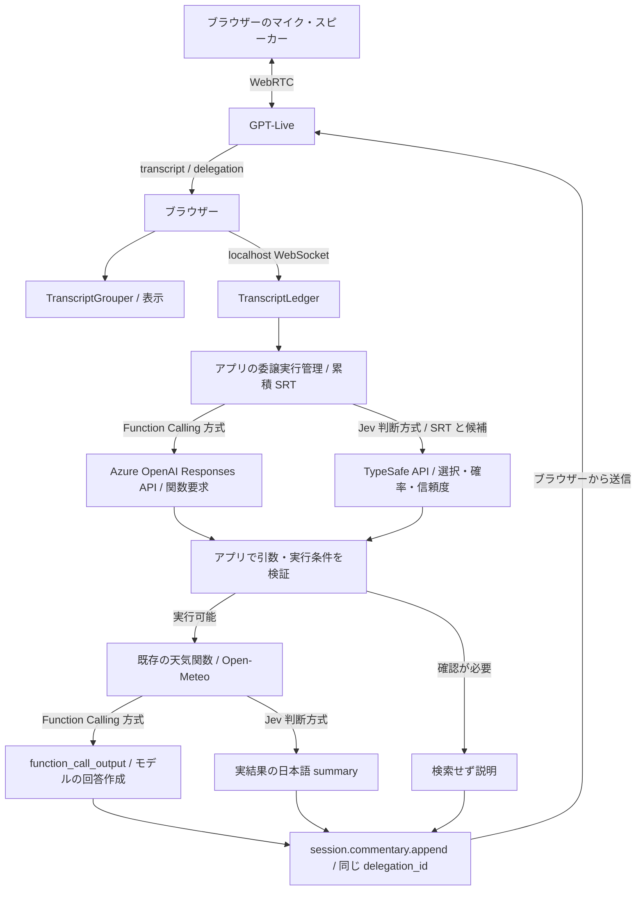

# 操作ガイドと詳細仕様

構築・起動手順とファイル構成は [README](../README.md) を参照してください。

`gpt-live-1` の transcript 処理を観察する、ローカル専用の Python Web UI です。
**Client delegation / Responses delegation を切り替えて、天気検索の実行経路を観察します。**
以下の Ledger と Function Calling / Jev の比較は Client モードの説明です。
Function Calling 方式は Azure OpenAI Responses API を利用します。モデルが関数の JSON Schema と
SRT から関数呼び出しの引数を生成し、アプリが実行します。実結果をモデルに戻して回答します。
Jev は SRT と事前定義候補から操作を選択し、実行条件を満たせばアプリが既存の天気関数を呼び出します。
Jev 方式の回答は実結果からコードで整形し、追加の回答生成モデルは呼びません。
両方式の入力・判断・実行・返却をタイムラインに表示します。汎用 Web 検索・任意コード実行はありません。

**同じイベントを並行処理するのは Grouper と Ledger です。Function Calling と Jev は委譲ごとに一方を選びます。**
Responses モードでは Grouper のみを使用し、Ledger は生成・記録・消費しません。

## 委譲モード

接続前に、画面上部の「委譲モード」で Client delegation / Responses + Function Calling を選択します。
接続中は変更できません。終了後に切り替え、新しいセッションを開始します。
**委譲モードを変更すると記録がリセットされるため、必要な記録は先に JSON 保存してください。**

| 構成 | バックエンドへの文脈 | Ledger | 利用可能な入力 |
| --- | --- | --- | --- |
| Client + Function Calling | アプリが準備 | 使用 | ライブ・リプレイ・音声なし実行 |
| Client + Jev | アプリが準備 | 使用 | ライブ・リプレイ・音声なし実行 |
| Responses + Function Calling | GPT-Live が供給 | 未使用 | ライブのみ |

### Responses モードの操作とタイムライン

1. 「Responses + Function Calling」を選択し、設定済みの委譲先モデルを確認します。
2. 「天気検索を実行する」を ON にして接続し、対応都市の現在の天気を依頼します。
3. `session.delegation.created` の `target: responses` と `response_id`、続く `response.event` 内の関数要求を確認します。
4. アプリが関数名・引数を検証し、許可された天気関数を実行します。結果を `response.item.create` で返し、その後に `response.create` を送信します。
5. Responses の続行・完了・失敗を確認します。回答は Live へ自動注入され、アプリから `session.commentary.append` を重ねて送りません。

タイムラインは「音声会話」「Responses 委譲」「Responses イベント・関数要求」「アプリの関数実行・取得結果」
「関数結果送信・処理再開」「Responses 完了・Live 自動注入」に切り替わります。
委譲 ID で絞り込めますが、ID で関連付けられない音声・文字起こしを特定の委譲に推測で結び付けません。
Ledger のパネル・レーン・集計は非表示になり、Jev・リプレイ・手動 consume・音声なし実行は利用できません。
Client モードに戻すと従来の表示と操作が戻ります。

検索 OFF や不正な関数要求では天気を取得せず、エラーの関数結果をモデルに返します。
OFF にしても音声セッションと Responses モデルの料金は発生し得ます。
本ラボの制限は、1 委譲あたり成功する天気検索が最大 1 回、関数要求が最大 4 件です。
結果の送信に失敗した場合は続行要求を送りません。重複した完了イベントで同じ関数要求を再実行しません。
アプリは送信を最大 10 秒、天気取得を最大 30 秒、委譲の完了を最大 90 秒待ちます。
これらはサービスの上限ではなく、[実行制御](../lab/execution.py)の上限です。

関数結果の追加には単独の成功 ACK がありません。「送信済み」はブラウザーからの送信確認であり、
API の受理を保証しません。Responses 完了も、Live の音声の発話・聴取完了を意味しません。
仕様: [Azure OpenAI の GPT-Live delegation](https://learn.microsoft.com/azure/foundry/openai/how-to/gpt-live-delegation)。

## 接続設定

初期表示は先頭の **ライブ接続** タブです。接続とマイク取得は
「マイクを許可して接続」を押したときだけ開始し、自動接続はしません。
API を使わず試す場合は、「関数実行プレイグラウンド」を開き、
**Client モードで「天気検索を実行する」を OFF にしてから** 2 番目の「リプレイ」に切り替えます。
OFF にせず再生すると、合成の委譲イベントでも選択した判断 API への要求が発生し得ます。

- **再生デモ（実行 OFF）**: API キー不要。実際の処理クラスに合成イベントを流します。API 録音の再生ではありません。
- **実マイク接続**: `.env` の `AZURE_OPENAI_ENDPOINT` / `AZURE_OPENAI_DEPLOYMENT` を設定して、
  Azure OpenAI に接続します。API キーがない場合は **Azure CLI のログイン済みアカウント**
  を使います。事前に `az login` を実行し、対象リソースの
  `Cognitive Services OpenAI User` 権限を用意してください。
  `AZURE_OPENAI_API_KEY` を設定する API キー方式も選べます。
  音声の接続先・デプロイ名には、この 2 つの環境変数名を使用します。
- **Client モードの Function Calling の判断モデル**：同じ `AZURE_OPENAI_ENDPOINT` にある `gpt-6-luna` デプロイを使用します。
  デプロイ名が異なる場合は `AZURE_OPENAI_BACKEND_DEPLOYMENT` に設定してください（既定値 `gpt-6-luna`）。
  音声用の `AZURE_OPENAI_DEPLOYMENT` とは独立しています。認証は同じ API キーまたは Azure CLI を使用し、
  ブラウザーには認証情報を返しません。この方式は音声を OpenAI に直接接続しても Azure OpenAI Responses API を使用します。
  Jev 判断方式は、この判断モデルの代わりに TypeSafe API を使用します。
  デプロイ名の変更はモデル種類の変更ではありません。実装は応答の `model` が
  `gpt-6-luna` または `gpt-6-luna-` で始まることを検証し、それ以外を拒否します。
- **Responses モードの判断モデル**：`LIVE_RESPONSES_MODEL` で指定します。
  Azure では Live と同じリソース内のデプロイ名を使い、省略時は `AZURE_OPENAI_BACKEND_DEPLOYMENT`（既定 `gpt-6-luna`）です。
  OpenAI ではモデル ID を使い、省略時は `gpt-5.5` です。Client モードのモデル名検証はこの経路には適用しません。
  構成は `tool_choice: auto`、`parallel_tool_calls: false` です。設定値の存在はモデルの利用可否を保証しません。
- **OpenAI への直接接続**: `LIVE_PROVIDER=openai` と `OPENAI_API_KEY` を設定します。
  Azure の設定が残っている場合も、`LIVE_PROVIDER` が優先されます。
  [.env.example](../.env.example) は設定例です。必要な場合だけルートに `.env` を作成し、既存の設定は上書きしないでください。
  環境変数がある場合はそちらを優先します。変更後はサーバーを再起動してください。
- GPT-Live 利用権限、マイク許可、HTTPS または localhost が必要です。
  音声は AI 生成です。実接続は有料で、WebRTC 初期化にも課金条件があります。
  [公式の料金・初期化課金](https://developers.openai.com/api/docs/guides/voice-latency-cost?api=live)を確認してください。
- localhost への接続はログインなしです。**インターネットや LAN に公開しないでください。**

### 接続エラーの確認

- セッション作成に失敗した場合、画面には HTTP ステータスと Azure / OpenAI の
  `code`、`type`、`param`、`message`、request ID を、サービスが返した範囲で表示します。
  認証情報・送信した指示文・SDP / ICE 認証情報はマスクし、未加工の応答本文は表示しません。
  サーバーログにはステータスだけを残し、詳細は画面で確認します。自動再試行はしません。
- `400 invalid_offer` / `Failed to parse offer: failed to unmarshal SDP: EOF` は、
  このアプリの文字列トリムが SDP 末尾の `\r\n` を削除していた不具合です。
  SDP をそのまま転送するよう修正済みです。古いプロセスには修正が反映されないため、
  起動中のサーバーを再起動してください。認証や quota の問題と決めつけないでください。

## 何を比較するか

以下の Grouper / Ledger 比較とリプレイ手順は Client モード専用です。Responses モードは [専用の操作手順](#responses-モードの操作とタイムライン)を参照してください。

この 2 つは同じ目的の代替アルゴリズムではありません。同じ受信イベントを両方に渡し、
比較表示・Grouper 表示・Ledger 表示を切り替えて、それぞれの役割を試します。

| | TranscriptGrouper | TranscriptLedger |
|---|---|---|
| 出典 | OpenAI Node SDK の公式ヘルパー | OpenAI Cookbook の Python サンプル |
| 目的 | チャット表示用の segment を作る | backend にまだ渡していない transcript を保持する |
| 実行場所 | ブラウザ（公式実装をローカルにバンドル） | Python サーバー（公式サンプルをそのまま使用） |
| 区切り | 話者、時間、相づち、50 ms の settle など | 同じ話者・近接時刻の fragment を統合 |
| 可視化 | complete snapshot、close reason、pending/current/buffered、設定値 | segment、時刻、全文、消費済み文字数、未消費部分、SRT |
| delegation | 関与しない | `consume_srt()` で未消費の全文を handoff にする |

### 最初に試す操作

1. 「天気検索を実行する」を OFF にし、「リプレイ」でシナリオを選んで 1 イベントずつ進めます。
2. Raw event の `start_ms` / `end_ms` と到着時刻、Grouper の buffer、
   Ledger の segment の変化を見比べます。
3. delegation が届くと、その瞬間の SRT が handoff に固定されます。
   後から到着する訂正は最初の handoff には入らず、次の handoff に入ります。
4. 相づちシナリオでは `backchannelMaxDurationMs` を `0` にしてリセットし、
   既定値のときと比較します。Grouper が省略した相づちも Raw event と Ledger には残ります。
5. 手動の `consume_srt()` は Ledger の消費だけを試します。GPT-Live には送信しません。

自動再生とステップ再生ではローカルタイマーの進み方が異なるため、Grouper の
結果が変わることがあります。これは公式実装の性質です。特に 50 ms の settle と
assistant の inactivity を、音声の終了やユーザー発話の確定と解釈しないでください。

### 内部処理タイムライン

タイムラインをメイン画面として、接続操作の直下に表示します。
接続 / 終了 / マイクのミュートは小型のアイコンボタンです。操作名はツールチップと
読み上げラベルに残し、ミュート中は斜線付きマイクと押下状態で区別します。
接続状態と音声の再生許可が必要な場合のボタンは、常に操作バーに表示します。
「設定」から接続情報・音声プレイヤー・セッションの指示・Grouper設定を開けます。
時間軸と倍率は常時表示し、レーン・本文検索・追従・波形などは
「検索・表示オプション」で展開します。タイムライン右上の一時停止アイコンは表示だけを停止します。
時間軸は「ローカル経過時間 / ソース時刻」、倍率は「等倍・横スクロール / 全体表示 /
0.1 倍 / 0.5 倍 / 2 倍」のボタンで直接切り替えます。選択中のボタンは枠と背景色で区別します。
波形で範囲を選択した場合は「選択範囲を拡大中」と表示し、倍率ボタンで通常表示へ戻れます。
タイムライン右上の全画面アイコンで、タイムラインを全画面表示できます。
全画面中も上部の操作バーからマイクの接続開始・停止・ミュートを操作できます。
リプレイ中は再生・停止・ステップ操作を表示します。接続状態とエラー通知も全画面内に表示し、
通常表示に戻すと操作バーは元の位置に戻ります。
同じボタンまたは Escape キーで通常表示に戻ります。非対応のブラウザーではボタンが無効になります。
「Grouper / Ledger の状態」はタイムラインの直下に、初期状態で展開して表示します。
Responses モードでは「Grouper の状態」だけを表示し、Ledger の処理も行いません。
設定・表示仕様・委譲・Raw ログはその下の折りたたみエリアにまとめています。
折りたたんでいても処理・記録・集計は継続します。

### 関数実行プレイグラウンド

接続操作の下、タイムラインの上にある「関数実行プレイグラウンド」は初期状態で折りたたまれています。
展開すると表示される「天気検索を実行する」は既定で ON です。別の「適用」操作は不要です。
OFF への変更で、既に開始した外部通信や料金を取り消せるわけではありません。戻り値の手入力は廃止しました。
以下は Client + Function Calling の手順です。Responses モードの経路は [委譲モード](#委譲モード)を参照してください。

1. ライブ接続して「東京の天気を検索せよ」と発話します。
2. `session.delegation.created` で公式 Ledger の `consume_srt()` を呼び、
   未消費 SRT をバックエンドへ渡します。バックエンドは前回までの SRT も保持します。
3. Azure OpenAI の `gpt-6-luna` に SRT と `tools` の JSON Schema を送信します。
   モデルが返す `function_call` の `call_id`・関数名・JSON 引数を検証し、
   `search_weather(city, time_scope)` を実行します。正規表現による引数抽出には戻しません。
   SRT は設定先の Azure に送信します。Open-Meteo へ送るのは都市名と座標のみです。
   ツールを呼ばずにモデルが確認質問を返した場合は、関数を未実行として表示します。
4. 取得結果を同じ `call_id` の `function_call_output` としてモデルへ戻し、短い回答を作ります。
   1 回目は `tool_choice: auto`、2 回目は `none` とし、1 回の委譲につき最大 1 関数・2 モデル要求です。
   Responses の `store: false` と `reasoning.effort: none` を使い、必要な会話履歴はアプリ側で管理します。
5. 同じ `delegation_id` の `session.commentary.append` に、確認できた結果を格納して
   Live のデータチャネルへ送信します。失敗時は成功文言ではなく失敗理由を返します。
6. 「往復をタイムラインで表示」またはタイムライン上部の「判断・関数実行の流れのみ」で、
   元発話・委譲・Ledger 入力・モデル要求と応答・実関数・返送・ACK を段階別に表示します。
   「委譲 ID」で 1 件の流れに絞り込めます。無関係な描画処理・ACK・音声は混ぜません。

#### Jev 判断モード

Client モードで「関数実行プレイグラウンド」の「判断モード」を「Jev 判断」に変更します。既定は「Function Calling」です。
Function Calling 方式の利用先は Azure OpenAI Responses API です。
変更は即時反映されますが、実行中は切り替えできません。委譲ごとに方式を保存するため、
完了後にモードを切り替えても過去の記録の方式は変わりません。

ルートの `.env` に `TYPESAFE_API_KEY` を設定してください。
モデルは `TYPESAFE_MODEL=jev-latest`、実行閾値は `JEV_CONFIDENCE_THRESHOLD=0.75` が既定です。
サーバーを再起動し、ページを再読み込みすると設定状況を表示します。
参考サンプルの `.env` は読み込みません。Jev 方式には Azure OpenAI の関数選択用モデルのデプロイは不要ですが、
ライブ音声の接続設定は別途必要です。キーが未設定なら音声なし実行ボタンは無効になります。

- **入力**：`state.ledger_srt` に累積の消費済み SRT、`state.current_srt` に今回消費した SRT、
  `questions.action.criteria` に対応都市の現在の天気・確認・対応外などの候補を渡します。
  USER / ASSISTANT を含む会話文脈が TypeSafe へ送信されます。音声・認証情報は送信本文に含めません。
- **判断**：選択候補、全候補の確率、`confidence` を検証します。未知の候補、不正な確率分布、
  通信失敗では実行しません。閾値未満や確認候補では、関数を呼ばず確認文を返します。
  `0.75` は設定値であり、天気検索で実測・最適化した値ではありません。
  確認待ち操作を「はい」だけで承認する仕組みは追加していません。都市と現在の天気を明示して依頼してください。
- **実行**：選択候補からコードで都市と `current` を確定し、既存の天気関数を呼びます。
  取得結果の日本語 `summary` を Live に返し、`function_call_output` や 2 回目の推論は生成しません。
  失敗時は成功として返さず、エラーを記録して伝えます。
- **表示**：「判断モデル / 実関数」の「Jev の選択・確率・信頼度」レーンで判定を選ぶと、
  右サイドバーに選択結果、実行可否、閾値、全候補の確率を表示します。
  「後段へ送信した Ledger」の詳細には選択肢・判断指示を含む実際の HTTP 本文を保存します。
  Jev の関数実行 ID はアプリ発行です。API が返していない応答 ID は補いません。

音声なし実行でも TypeSafe の料金が発生します。実 API の接続・判定精度・速度比較は未検証です。
仕様：[TypeSafe API](https://docs.typesafe.ai/api)。

#### Client モードの判断モデルの入力と往復を確認する

**TranscriptLedger のタイムライン内**で、次の色・枠・ラベルを区別します。

| 表示 | 意味 |
| --- | --- |
| 緑 | Ledger の追加・更新 |
| 黄・破線 / 「消費のみ（送信ではない）」 | 消費カーソルが進んだ記録。モデルへの送信を意味しません |
| オレンジ・太枠 / 「↑ 後段へ送信開始」 | モデルへの HTTP 入力を記録したカード。送信開始であり、成功はモデル応答で確認します |

オレンジのカードは「後段へ送信した Ledger / HTTP 入力」レーンに表示します。
「TranscriptLedger」だけに絞っても表示され、「判断モデル / 実関数」へ切り替える必要はありません。
「transcript 本文」を OFF にしても色・枠・送信ラベルを維持します。
送信時刻はローカル経過時間です。ソース時刻表示には音声区間を持つ snapshot だけを表示します。
更新中の Ledger と実際の送信入力は別の時点の記録なので、既存の緑のカードを推測で送信済みに塗り替えません。

送信カードには、送信 SRT の末尾の発話をプレビュー表示します。
SRT の番号や時刻だけでカードが埋まらないよう、プレビューではヘッダーを省きます。
その呼び出しに渡した累積 SRT の原文は変更せず保持します。
右サイドバーでは、省略なしの SRT、今回消費した分との差、モデル / デプロイ名、round、
`response_id`、`call_id`、`delegation_id` を確認できます。
「HTTP に渡したリクエスト本文」には `input`・`instructions`・`tools`・`tool_choice` など、
HTTP 呼び出しに渡す同じ本文を記録します。認証ヘッダーは記録しません。
入力は送信時点でコピーし、2 回目の要求に関数出力を追加しても 1 回目の記録は変わりません。
既に起動している Python サーバーは再起動してください。旧通知に送信本文がなければ、
サイドバーに未記録であることを表示します。

```mermaid
flowchart LR
   A[Ledger の元発話] --> B[Client delegation]
   B --> C[累積 SRT を送信]
   C --> D[モデル round 1]
   D --> E[function_call と引数検証]
   E --> F[実関数]
   F --> G[function_call_output]
   G --> H[モデル round 2 の回答]
   H --> I[commentary.append 準備]
   I --> J[LIVE へ送信]
   J --> K[対応する ACK]
```



モデルの生の `function_call` と検証済み引数、実関数の戻り値、モデルの最終回答、
LIVE に渡す文章は別々のカードです。確認質問などで関数を要求しなかった場合や、
失敗・中止・新しい委譲による置き換えは、実行済みにせずそのまま表示します。
「送信開始」は受理の保証ではなく、モデルの応答・失敗を併せて確認します。
音声なし検証では LIVE への返送は `not_sent` です。

元発話は Ledger の生成元 `event_id`、返送の ACK は `client_event_id` と送信コマンドの ID で
関連付けます。累積 SRT に含まれる過去の発話は、複数の委譲に表示される場合があります。
これは送信入力への包含関係であり、その発話が委譲を起こしたという推論ではありません。
ID のない出力 transcript・音声波形は特定の返送に結び付けず、通常表示で確認します。
入力 SRT・関数結果は機微な情報を含む場合があり、タイムラインの JSON 保存にも含まれます。

処理順序の仕様：
[Azure OpenAI Responses API の Function Calling](https://learn.microsoft.com/azure/foundry/openai/how-to/responses#function-calling)、
[Client delegation](https://developers.openai.com/api/docs/guides/live-delegation?delegation-mode=client)。

音声なしでも「この発話でモデル・関数を実行」で試せます。**音声なしでも、選択した判断モデルの料金が発生します。**
この場合は発話と委譲だけが合成で、モデル要求と天気 HTTP は実通信です。Live には送信せず `not_sent` と表示し、
ACK や音声出力を合成しません。実行 OFF では検索せず、無効である旨を返します。

検索中も transcript の記録は継続します。発話より先に委譲が来た場合は最大 2 秒待機し、
新しい未消費 SRT を取得します。この待機は公式の発話完了判定ではありません。
新しい委譲に置き換えられた古い結果は返却せず、切断・リセット・実行 OFF で処理を中止します。
消費した SRT はハンドオフに残り、ネットワーク失敗で消費カーソルを巻き戻しません。

対象は対応都市の現在の天気です。都市の欠落・曖昧な依頼・非対応の依頼は確認を求め、
東京などを暗黙の既定値にはしません。対応都市は画面に表示します。
Function Calling 方式では Azure OpenAI のモデルが引数を生成し、Jev 判断方式では選択候補からコードで引数を確定します。
どちらも実行主体はアプリです。判断モデルの認証・設定・応答に問題があればエラーを表示し、別モデルで自動代替しません。
`session.commentary.appended` は発話完了を保証せず、音声と委譲の因果関係も時刻だけでは確定しません。

仕様：[Azure OpenAI Responses API](https://learn.microsoft.com/azure/foundry/openai/how-to/responses)、
[Function Calling](https://developers.openai.com/api/docs/guides/function-calling)、
[Client delegation](https://developers.openai.com/api/docs/guides/live-delegation?delegation-mode=client)、
[Open-Meteo 天気 API](https://open-meteo.com/en/docs)、
[地名検索 API](https://open-meteo.com/en/docs/geocoding-api)。

画面はブラウザーの横幅全体を使用します（固定の最大幅なし・左右の操作用余白は維持）。
右上の月 / 太陽アイコンでライト / ダークテーマを切り替えられます。
初回はOSの配色設定を使用し、手動で選んだテーマはこのブラウザーに保存します。
テーマ変更は接続・記録・フィルター・倍率・表示停止状態を変更しません。
設定の保存が許可されていない場合は通知し、その画面内での切り替えは継続できます。

画面上部のガントチャートで、処理の開始・終了・所要時間・状態を確認できます。
バーや本文カードを選択すると、右サイドバーが開き、処理の要約・全文・JSON と
関連 `event_id` / `request_id` / `delegation_id` を表示します。
右上のサイドバーアイコンで表示 / 非表示を切り替え、サイドバー内の閉じるボタンでも閉じられます。
境界線のドラッグで幅を変更でき、非表示にしても選択と幅はその画面内で維持します。
境界線にフォーカスして左右キー（Shift 併用で大きく移動）、Home / End（最小 / 最大）、
Enter（閉じる）でも操作できます。サイドバー内では Escape でも閉じられます。
狭い画面ではチャート右側に重ねて表示し、ページ全体の横はみ出しを防ぎます。
幅変更では倍率・フィルター・記録を変えず、表示停止中の内容も進めません。
レーンの絞り込み、処理名・ID 検索、エラーのみ表示、ズーム、最新時刻への追従に対応します。
「表示を一時停止」は描画だけを停止し、イベント処理と記録は続けます。
表示倍率の初期値は **等倍・横スクロール（1 ms = 1 CSS px）** です。
短い記録を画面幅へ引き伸ばしたり、長い記録を自動縮小したりせず、固定倍率を維持します。
「全体表示」で記録全体を画面幅に合わせる縮小表示へ切り替えられます。
0.1 倍・0.5 倍・2 倍も選択できます。過去の区間を横スクロールで確認するときは
「最新時刻を追従」を OFF にしてください。

短い処理や瞬間的なイベントにも、通常 160〜220 CSS px の名前ラベルを表示します。
長い処理名は 2 行まで折り返し、全文と正確な時刻はホバーまたはサイドバーで確認できます。
上端の線は実際の時間区間、短い縦マーカーはイベントの時刻です。
箱の幅は読みやすさのために広げるため、所要時間と同一ではありません。
密集するラベルは段を分け、時間軸の右端ではラベルを内側へ寄せて名前を保ちます。
表示領域がラベルより狭い場合は、その領域の幅まで縮めます。

**時間軸のドラッグ**: 「リセットからの経過時間」（ソース時刻では「音声ソース時刻」）や
目盛りをつかんで動かすと、タイムラインを縦横にスクロールできます。
横方向にスクロールしたら最新時刻への追従を自動で OFF にし、調べている位置を維持します。
再開するには「検索・表示オプション」の「最新時刻を追従」を ON にしてください。
ドラッグを離すと、直前 100 ms のスクロール速度に応じて縦横に慣性が付き、徐々に減速します。
離す前に手を止めた場合は慣性を付けず、スクロール端ではその方向の移動を止めます。
押し直す・ホイール操作・キー操作・表示条件の変更で慣性を停止します。
端末の「動きを減らす」設定が有効な場合は慣性を付けません。
単なるクリックでは追従状態を変えません。Escape でドラッグ・慣性を終了できます。
記録・表示停止状態・倍率・波形の範囲選択は変更しません。

**波形の範囲選択**: 「全体表示」でマイク入力または AI 出力の波形を左右にドラッグし、
離すと選択した時間範囲へ全レーンを拡大します。ドラッグ中は両方の波形に選択範囲を示し、
開始・終了・区間長を表示します。逆方向のドラッグにも対応し、Escape で取り消せます。
拡大後も波形をドラッグして、さらに狭い時間範囲へ絞り込めます。
単なるクリックや 6 CSS px 未満の移動、1 ms 未満の区間では拡大しません。
区間に重なる処理・本文を表示し、区間をまたぐバーは境界で切り取ります。
右サイドバーには元の開始・終了・全文を維持し、記録や JSON 出力は削除・変更しません。
選択中は新しい記録が増えても表示範囲を固定し、最新時刻の追従は一時的に無効にします。
「全体表示に戻す」または倍率の選択で解除できます。時間軸の変更・リセットでも解除します。
範囲選択・解除・幅変更は表示停止中の時刻や波形を進めません。
波形のないリプレイ、ソース時刻表示、固定倍率ではドラッグによる範囲選択は行いません。

ライブ接続では、同じローカル時間軸の先頭に **マイク入力 / AI 出力（受信）の音声波形**
を表示します。「音声波形」で表示を切り替えられ、コンポーネントや処理の絞り込みに
かかわらず比較用の共通レーンとして表示します。Web Audio の AudioWorklet で
20 ms ごとにピーク（薄色）と RMS（濃色）を集計し、各入出力の記録開始からの
全履歴を保持します。時間・件数による自動削除はありません。音声そのものは録音・保存せず、JSON 保存にも
振幅の集計値だけを含めます。リセットで波形も消去し、切断時は計測を終了します。
ブラウザーが計測を停止した場合は「波形計測を再開」を押してください。
計測に失敗した場合は通知し、通常の音声接続は継続します。

波形は Web Audio の時計からローカル経過時間に推定配置します。API の
音声ソース時刻とは同期していないため、ソース時刻表示では波形を表示しません。
AI 出力は受信トラックの振幅であり、スピーカーでの再生完了や VAD を示しません。
リプレイには音声データがないため、模擬波形は生成しません。

#### 発生元ごとの表示モード

「transcript 本文」（初期値 ON）で実際の文字列をタイムライン上のカードに表示します。
「文字列の記録のみ」を ON にすると、以下の 3 種類だけを比較できます。

- **RAW 差分**: 受信した `session.input_transcript.delta` / `session.output_transcript.delta`
  の `delta` をそのまま表示します。重複受信も表示し、空白・改行・繰り返しを改変しません。
- **Grouper 全文**: `segment.updated` / `segment.closed` ごとの全文 snapshot です。
  更新前の文字列も残します。相づち抑制などで SDK が出力しなかった本文は補完しません。
- **Ledger 全文**: Python サーバーから受信した実際の Ledger segment を記録します。
  本文・消費カーソル・区間などが変化したときだけ追加し、同じ状態の応答は重複記録しません。
  カードを選択すると全文と消費済み / 未消費の文字列を省略なしで確認できます。
  ブラウザーで RAW から Ledger の統合を再実装・推測するものではありません。

カード上端のマーカーはローカルの記録時刻（RAW 受信 / Grouper 通知 / Ledger snapshot 受信）、
ソース時刻では各データが保持する音声区間を示します。範囲端のラベルを内側へ寄せても、
マーカーは元の時刻に置きます（範囲外の時間区間は境界で切り取ります）。
本文を読みやすくするためのカード幅は発話や処理の長さを表しません。
カード内は長文を省略表示しますが、選択した本文・ツールチップ・JSON には全文が残ります。
本文検索、既存のコンポーネント・レーン絞り込みと組み合わせて使えます。
記録後の更新や消費で過去の本文を書き換えず、リセットまで全履歴を保持します。

「標準 / すべて / GPT-Live / TranscriptGrouper / TranscriptLedger / 判断モデル・実関数 / App・transport」を
切り替えて表示します。初期値は「標準」で Grouper を除外します。「すべて」または
「TranscriptGrouper」で Grouper のレーンも表示できます。各表示は発生元ごとに分かれます。
ボタンの件数は保持中の計測レコード数（ほかのフィルター適用前）です。
切り替えは表示だけを変更し、入力・SDK処理・Ledger・記録履歴には影響しません。

- **GPT-Live**: APIから受信した公開イベントのみ。セッション、入力 / 出力transcript、
  delegation、context ACK、usage、audio制御、errorを別レーンに表示します。
  `response.event` は内側の `event.type` をラベルに含め、外側の `delegation_id` と
  元のJSONも保持します。未知の受信イベントは「Other API events」に残します。
  リプレイの場合は合成イベントと明示し、モデルからの実受信とは区別します。
- **TranscriptGrouper**: アプリ内で動作する公式SDK helperの観測結果。`push`、pending の flush、
  grouping の process / advance / backchannel 判定 / promote、segment 更新・閉鎖。
  pending / buffered / current のバーは状態の保持期間で、CPU 実行時間ではありません。
  タイマーだけで発生した更新も記録します。
- **TranscriptLedger**: PythonのLedgerとアプリのアダプターによる入力検証、`record_event`、
  merge / duplicate、`consume_srt`、非消費の SRT プレビュー、handoff 状態。
  Ledger自体のネイティブなイベントAPIではなく、このアプリの計測です。
- **判断モデル / 実関数**: SRT、モデル要求・使用量、Azure OpenAI Responses API の応答 ID・`call_id`・引数、
  Jev の選択候補・全候補の確率・信頼度・実行閾値、実関数の実行区間、
  天気 API の結果と出典 URL、方式に応じた結果返却、失敗理由、append の生成。
  区間位置は通知のブラウザー受信時刻です。
- **App / transport**: アプリからの送信コマンド、IDの正規化、観察用WebSocket、
  リプレイ制御・待機、UI描画・通知、マイク許可、SDP、ICE、HTTPセッション作成、サーバー認証・
  upstream API 待機、data channel、`session.started` / `session.closed` 待機、
  マイクの有効・ミュート期間、HTML audio の再生状態、エラーと終了時の解放。
  送信コマンドはモデルが発出したイベントには分類しません。

モードごとにレーン選択肢と公式仕様・実装リンクを切り替えます。バーを選択すると、
発生元・イベント名・所要時間・関連IDを要約カードとJSONで確認できます。
`prepared` と `sent` はACKとは別です。終了までACKがなければタイムラインは
`unconfirmed` として待機を終了し、Ledgerの元の状態は変更しません。

時間軸は「ローカル経過時間」と「音声ソース時刻」を切り替えます。
ソース時刻の図は時刻付き公開イベント、Grouper の segment、Ledger の snapshot が持つ音声区間を表示し、
ネットワークや Python 処理を同じ音声時計に載せません。Python の区間は
`perf_counter` で実測し、応答に含めた相対時刻からブラウザーの往復区間内へ
**推定配置**します。時計同期・片道ネットワーク遅延の計測ではありません。
認証・upstream の計測値は `Server-Timing` で渡し、認証情報・SDP は記録しません。
Ledger のソース時刻では snapshot が保持する音声区間のみを表示し、Python の処理時間や
消費が発生した時刻はローカル経過時間で確認します。App モードへ切り替えると
ローカル経過時間を選択し、ソース時刻の選択を無効にします。
検索・エラー絞り込みはモード間で維持します。「絞り込みを解除」で全レーン・検索なし・
ローカル経過時間へ戻せます。表示モードと倍率は維持します。

API が公開しないモデル内部の推論・VAD・ツール実行は可視化できません。
音声トラックの有効期間や HTML audio の状態も、発話区間やユーザーの聴取完了を
示すものではありません。機能の解説と公式ドキュメントへのリンクは
画面の「機能仕様と公式ドキュメント」に掲載しています。

タイムラインは記録開始からの全処理を保持します。最新 300 件だけに絞る表示や、
20,000 件を超えた古い処理の削除は行いません。delegate や ACK を含む過去のレーン、
時間軸の範囲、選択した処理の詳細は、新しいイベントが増えても失われません。
表示負荷を抑えるため、全履歴でレーン配置を決めたうえで、画面内とその近傍のバーだけを
描画します。過去へ横スクロールしたり下へ縦スクロールすると、対応するバーを再描画します。
件数はフィルター対象・全保存件数・画面内描画件数を区別します。
短い区間は選択できるよう最小 7 px に拡幅しますが、実際の時間は詳細に表示します。
既存 JSON エクスポートの `operation_timeline` に保持中の全区間を含めます。
各区間の `component` は `live` / `grouper` / `ledger` / `backend` / `app` のいずれかです。
フィルターで非表示になっている区間もエクスポートに含めます。
接続失敗時も Raw event の有無にかかわらず保存できます。全履歴はブラウザーのメモリに
保持するため、記録時間に応じてメモリ使用量が増えます。リセット・モード切替・新しい接続の開始・
ページ再読み込みで履歴を消去するため、必要な履歴は事前に JSON 保存してください。

### Transcript / delegation の注意点

以下の Ledger の消費・commentary の ACK に関する注意は Client モードに適用します。
Responses モードでは Ledger を使わず、送信状態と Responses の完了・失敗を別に記録します。

- `segment.id` はローカルの表示 ID です。API の turn/item ID や delegation ID ではありません。
- Azure のように transcript に `event_id` が含まれない場合は、受信ごとに一意な
  ローカル ID を補い、Grouper と Ledger に同じイベントを渡します。元の Raw event は
  別に残します。この ID はサーバーの ID ではなく、ID がないイベントの再配信は
  自動的には重複判定できません。公式ヘルパーの実装自体は変更しません。
- `segment.updated` は差分ではなく全文です。UI は文字列を追記せず置き換えます。
- `segment.closed` は表示上の確定であり、再生完了を意味しません。
- `delivered_characters` は Cookbook 内の**ローカル消費カーソル**です。
  GPT-Live が受け取ったことは `prepared` / `sent` / `acknowledged` / `send_failed` /
  `rejected` の別状態で確認します。再生デモの送信はシミュレーションです。
  Azure の成功 ACK などで対応 ID が返らない場合は「対応不明」として記録し、
  推測で handoff を `acknowledged` にしません。ACK は内容の発話・操作成功の保証ではありません。
- Ledger の消費後に同じ segment が延びる場合、SRT は未消費の文字列だけになりますが、
  時刻は segment 全体の時刻です。正確な単語境界ではありません。
- `delegation.offset_ms` は表示するだけで、transcript の切り出しには使いません。
  「delegation の原因になった一文」を特定する機能はありません。
- Grouper の private state / メソッド境界は診断用アダプターで観測します。
  引数・戻り値・例外を元のメソッドに転送し、vendor 原本・タイマー・グルーピング規則は
  変更しません。安定した SDK API ではないため、SDK 更新時にはアダプターの
  互換性と公式実装との出力一致を検証してください。計測・描画自体の負荷は発生します。
- 画面のログには会話内容が含まれます。JSON をダウンロードする際は取り扱いに注意してください。

## 内部構成と通信

図は Client モードの経路です。Responses モードでは GPT-Live がモデルへ文脈を供給し、
アプリは Ledger を通らずに関数要求を受けて、結果送信と続行を行います。



- `POST /api/session`: Python が Azure では `POST {endpoint}/openai/v1/live/sessions`、
  OpenAI では `POST https://api.openai.com/v1/live/sessions` に
  `{session, transport: {type: "webrtc", sdp}}` を送ります。選択した `delegation_mode` に応じて
  `delegation.type` を `client` または `responses` に設定します。Responses ではモデル・指示・関数定義も設定します。
  Azure の `session.model` には deployment 名を使用します。
  API キーや Entra トークンはブラウザに返しません。
  指示文の前後空白だけを除去し、SDP は末尾の CRLF を含めて変更せずに転送します。
  課金されるセッション作成を自動再試行しません。
- WebRTC の HTTP 作成時点で開始するため、`session.start` は送信しません。
  `session.started` 後にだけ application command を送信します。
- 停止時は `session.close` と `session.closed` の応答を待ち、タイムアウト・切断時も
  マイクと接続を解放します。
- 観察用 WebSocket ごとに会話状態と実行管理を分離し、Client モードの場合だけ Ledger を生成します。Raw event / transcript は自動でファイル保存しません。
  音声接続を終了しても検討用に表示は残ります。リセットで履歴を消去し、
  観察用 WebSocket を切断するとサーバーの状態も破棄します。通常処理では会話本文をログ出力しません。
  例外ログも含め、共有前には機微な情報の有無を確認してください。
- 1 回の観察は最大 5,000 イベント、入力フレームは最大 64 KiB、処理 trace は最新 200 件です。
  上限に達したら必要なログを保存してリセットしてください。
- HTTP サーバーは `.env` / Python ソース / vendor の原本を配信しません。ブラウザには UI と
  ビルド済み Grouper、およびそのライセンスだけを配信します。

## 開発・検証

以下は開発者が必要に応じて実行するコマンドです。今回の公開用整理では実行していません。
Python の仮想環境を有効にして実行するか、[起動手順](../README.md#起動)に示した OS 別の実行ファイルを指定してください。

```sh
python -m unittest discover -s tests -v
npm ci
npm run build
npm test
```

Python テストは標準ライブラリの `unittest` です。Live API はモックしており、
テストに API キーや課金は不要です。テストには 500 ms 境界、重複、遅延訂正、
未消費 SRT、origin 制限、セッションの分離、API 失敗、WebSocket の操作、
SDP の CRLF 保持、エラー詳細のマスクを含みます。
Azure / OpenAI の接続先・認証ヘッダーと認証失敗もモックで検証します。
`live_available` は設定の準備が整っていることを示すだけで、Azure の認証・利用権限・
ネットワーク接続を保証するものではありません。実マイクでの有料疎通は別途必要です。

Node.js は公式 TypeScript ヘルパーの再バンドルとテスト時だけ必要です。開発時は Node.js 22 以降を推奨します。
`npm test` の `pretest` でも再ビルドします。Python の許容範囲は [pyproject.toml](../pyproject.toml)、
固定バージョンは [requirements.txt](../requirements.txt)、npm の固定解決結果は [package-lock.json](../package-lock.json)にあります。
Windows / PyPy では `uvloop` をインストール対象から外します。根拠：[Uvicorn の依存定義](https://github.com/Kludex/uvicorn/blob/main/pyproject.toml)。

### 確認範囲

2026-09-28 の公開用整理は、実装と文書の照合、エディター診断、配布対象の確認です。
同期元の Responses 実装では、ブラウザーと合成イベントで Ledger 不使用、結果送信後の続行、重複イベント、
不正な関数、送信失敗、API エラー、モード切替とモバイル表示を確認しました。実モデルの推論ではありません。
配布版のローカル起動、委譲モード切替時の画面位置の維持、選択欄とボタンの表示をデスクトップ・モバイル幅と明暗テーマで確認しています。
依存関係のインストール動作、実マイク、有料 API の疎通は未確認です。
追加した回帰テストは VS Code で検出されず未実行で、今回の配布更新でもコマンドによるテストは実行していません。
過去の開発記録のテスト件数を、この配布物の合格結果として転記していません。
実際の音声応答、Jev の日本語判定精度、判断方式間の速度・費用比較は未検証です。

## 参照元

- [TypeSafe API / Jev の入力と Choice 応答](https://docs.typesafe.ai/api)
- [TypeSafe Confidence](https://docs.typesafe.ai/confidence)
- [公式 TranscriptGrouper 使用例](https://github.com/openai/openai-node/blob/5d258e4e82d7655fa82a4688fc04c53359417d27/examples/live/README.md)
- [公式 TranscriptGrouper 実装](https://github.com/openai/openai-node/blob/5d258e4e82d7655fa82a4688fc04c53359417d27/src/lib/live/transcript-grouper.ts)
- [公式 TranscriptLedger 実装](https://github.com/openai/openai-cookbook/blob/5986832a554169dc87285b1b0b396941f235a62e/examples/audio/duplex_voice_agent_evaluation/assistants/client/memory.py)
- [Client delegation](https://developers.openai.com/api/docs/guides/live-delegation?delegation-mode=client)
- [WebRTC](https://developers.openai.com/api/docs/guides/voice-webrtc?api=live)
- [セッション・transcript の仕様](https://developers.openai.com/api/docs/guides/live-conversations)
- [Azure GPT-Live WebRTC](https://learn.microsoft.com/azure/foundry/openai/how-to/gpt-live-webrtc)
- [Azure GPT-Live の Client / Responses delegation](https://learn.microsoft.com/azure/foundry/openai/how-to/gpt-live-delegation)

公開用構成には開発時の設計メモ・レビュー草稿・別アプリの参考サンプルを含めていません。
実装の根拠は上記の固定コミットと公式プロトコルです。
第三者コードのライセンスと変更範囲は [THIRD_PARTY_NOTICES.md](../THIRD_PARTY_NOTICES.md) を参照してください。
